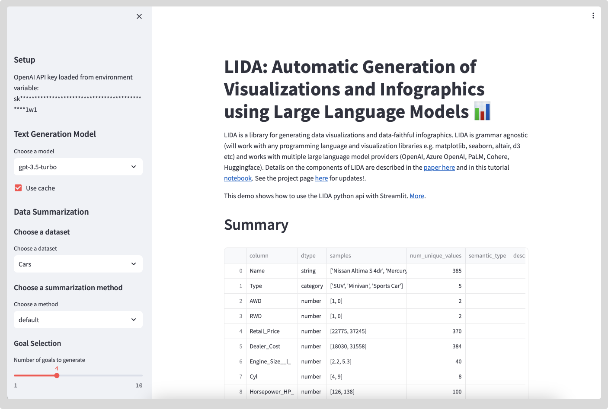

# LIDA Streamlit Application 📊

## About The Project

This Streamlit application demonstrates an implementation of [LIDA](https://github.com/microsoft/lida) using Streamlit front end.

LIDA is a library for generating data visualizations and data-faithful infographics. LIDA is grammar agnostic (will work with any programming language and visualization libraries e.g. matplotlib, seaborn, altair, d3 etc) and works with multiple large language model providers (OpenAI, Azure OpenAI, PaLM, Cohere, Huggingface). Details on the components of LIDA are described in the [paper here](https://arxiv.org/abs/2303.02927) and in this tutorial [notebook](notebooks/tutorial.ipynb).

See the project page [here](https://microsoft.github.io/lida/) for updates!.

## What you will learn

Exploring this application will help developers familiarize themselves with Large Language Models' integration, specific operations like data summarization, goal selection, and visualization. It also teaches developers how to manage secrets (like API keys) securely using .env files and showcases how to utilize pre-trained models for text generation.

## Getting Started

1. You need to have Python 3.7+ and pip installed.
2. Clone the repo and navigate to the project directory.
3. Install the required dependencies by running `pip install -r requirements.txt`.
4. Get your OpenAI API key and set it as an environment variable.
5. Run `streamlit run app.py` in the terminal to launch the application in your web browser.

## Contributing

This project welcomes contributions and suggestions.

Happy Learning!
